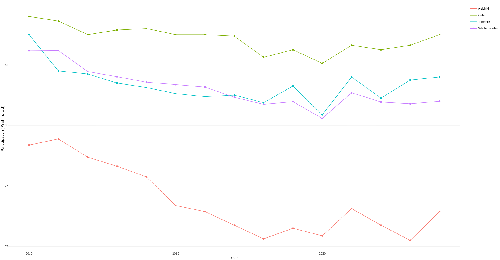
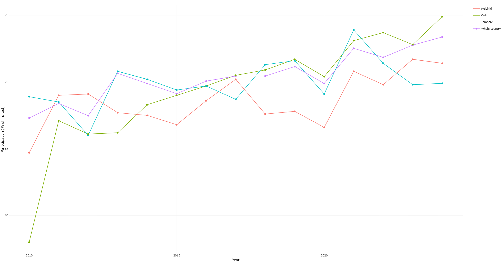
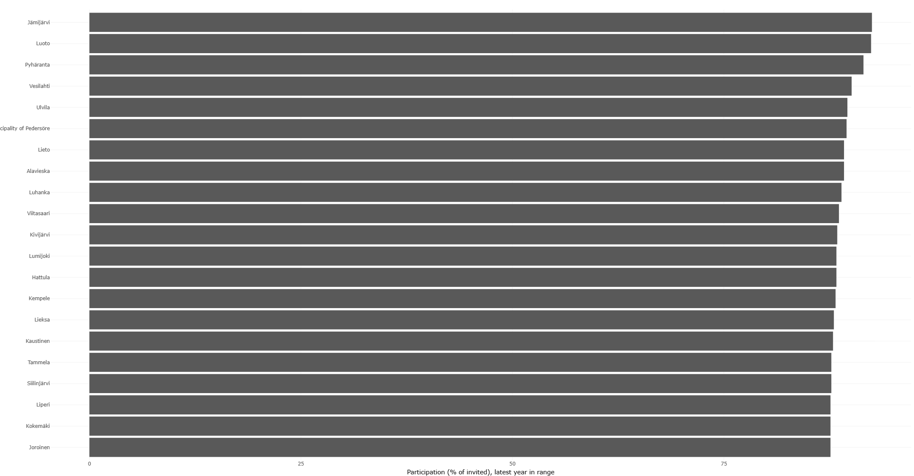

# Cancer Screening Dashboard

**Live dashboard:** https://p1erji-md0abdul0aziz.shinyapps.io/cancer-screening-dashboard/

An interactive R Shiny dashboard showing participation in three Finnish cancer screening programmes (breast, cervical, colorectal) by municipality and year. I built it to practise a full public health analytics workflow: importing open data, cleaning it, analysing it, and presenting it in a dashboard. It is my first Shiny app.






## Data

- Source: THL Sotkanet, indicators from the Finnish Cancer Registry (https://sotkanet.fi)
- Indicators: 3620 (cervical, Pap), 3621 (breast, mammography), 6103 (colorectal). Each is the share of invited people who took part, in %.
- Level: municipality, 2010 to 2024 (colorectal only 2022 to 2024)
- Downloaded: 2 October 2026 with the `sotkanet` R package
- 9,782 rows. I checked missing values, and none needed removing.

## What I did

1. `R/01_import.R` downloads the data from Sotkanet.
2. `R/02_clean.R` checks missing values, renames variables, labels the three screenings in English, and saves a CSV and a SQLite database.
3. `R/03_analysis.R` calculates trends by year, ranks municipalities, fits a simple linear model, and saves a trend figure.
4. `dashboard/app.R` is the Shiny app (screening type, municipalities, years, whole-country line, regional comparison).

## What I found

- Breast screening participation fell slowly, from about 87% (average across municipalities, 2010) to about 83% (2024). It dipped in 2020 and partly recovered in 2021. This may be related to COVID-19, but this data cannot show the cause.
- Larger cities have lower breast screening participation. In 2024, Helsinki was around 74% and Oulu around 85%.
- Cervical screening is flatter, at about 70 to 74% on average, but the differences between municipalities are larger than for breast screening.


## Limitations

- Small municipalities have few invited people, so their rates jump around from year to year.
- Averages across municipalities treat a small and a large municipality equally. The "whole country" line in the dashboard is a population-weighted average I calculated from the municipal data, so it is not an official national figure.
- Some cervical screening series have sudden jumps (for example around 2011 to 2013 in a few cities). I have not checked whether they come from real changes or from changes in how the data was recorded.
- Colorectal data covers only 2022 to 2024, so no trend can be drawn.
- The y-axis does not start at zero, which makes differences look larger.
- The analysis is descriptive. It does not explain why participation differs.

## Run it yourself

I built this in Posit Cloud. Packages used: tidyverse, janitor, sotkanet, DBI, RSQLite, shiny, bslib, plotly.

```r
install.packages(c("tidyverse","janitor","sotkanet","DBI","RSQLite","shiny","bslib","plotly"))
source("R/01_import.R")
source("R/02_clean.R")
source("R/03_analysis.R")
shiny::runApp("dashboard")
```

## Next steps

- Add cancer incidence data to compare with participation
- Add confidence intervals for small municipalities
- Check the cervical screening series against registry notes

## Credits

Data: THL Sotkanet / Finnish Cancer Registry (https://sotkanet.fi). Author: Md. Abdul Aziz, https://www.linkedin.com/in/mdabdul-aziz/.